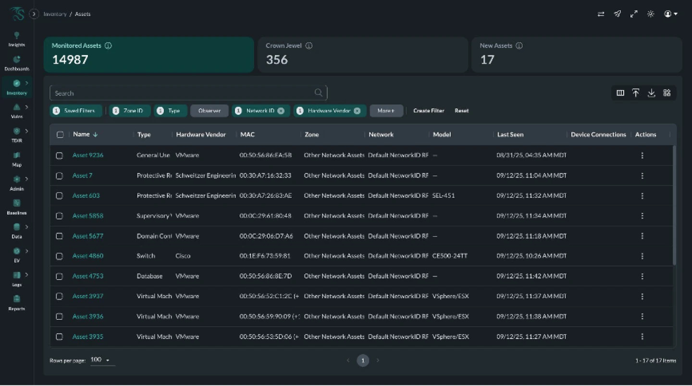
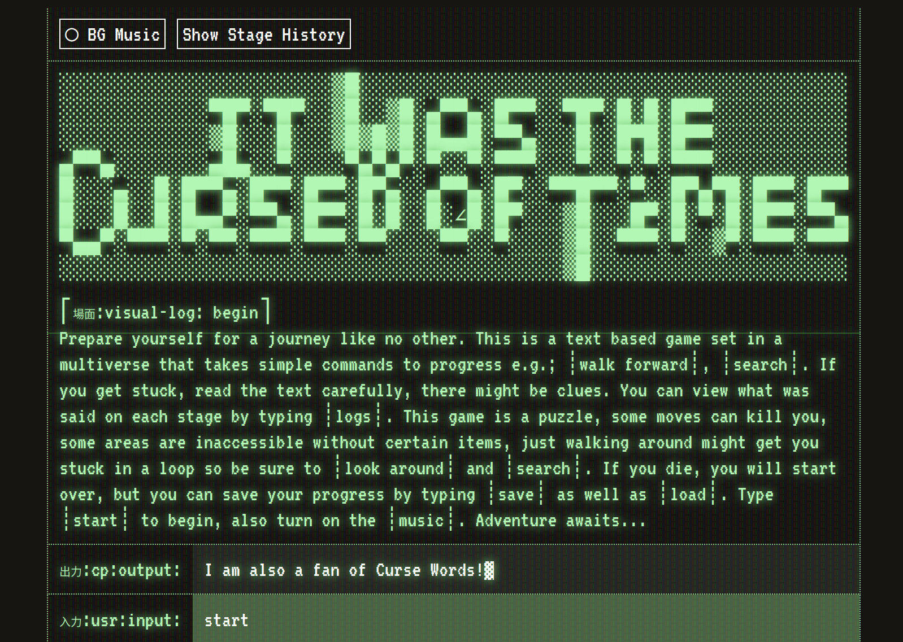

## Hello World!

I am a frontend-focused software engineer passionate about designing thoughtful, scalable user experiences. With over  years of experience leading technical initiatives and growing products from startup to enterprise, I specialize in building clean, reliable interfaces that balance performance, usability, and long-term maintainability.

<h3 class="badge-heading">Contact</h3>

<a href="https://www.linkedin.com/in/petergrillot/" target="_blank">LinkedIn</a>
<a href="https://github.com/PeterGrillot" target="_blank">Github</a>
<a href="mailto:petergrillot+portfolio@gmail.com" target="_blank">Email</a>

## Skills

### Frontend

  <ul class="badge-list">
    <li class="badge">React</li>
    <li class="badge">TypeScript</li>
    <li class="badge">Next.js</li>
    <li class="badge">Redux | RTK</li>
    <li class="badge">Material UI</li>
    <li class="badge">Radix UI</li>
    <li class="badge">shadcn</li>
    <li class="badge">Tailwind</li>
    <li class="badge">Mapbox</li>
    <li class="badge">d3</li>
    <li class="badge">HTML</li>
    <li class="badge">CSS</li>
    <li class="badge">canvas</li>
  </ul>
  
  ### Backend
  
  <ul class="badge-list">
    <li class="badge">Nest.js</li>
    <li class="badge">Node</li>
    <li class="badge">Prisma ORM</li>
    <li class="badge">Postgres</li>
    <li class="badge">tRPC</li>
    <li class="badge">GraphQL</li>
    <li class="badge">Relational Databases</li>
    <li class="badge">NoSQL</li>
    <li class="badge">Python</li>
    <li class="badge">Kotlin</li>
  </ul>
  
  ### Testing & Debugging
  
  <ul class="badge-list">
    <li class="badge">Jest</li>
    <li class="badge">RTL</li>
    <li class="badge">Cypress</li>
    <li class="badge">Playwright</li>
  </ul>
  
  ### Infrastructure & DevOps
  
  <ul class="badge-list">
    <li class="badge">AWS</li>
    <li class="badge">Docker</li>
    <li class="badge">CI/CD</li>
    <li class="badge">Git</li>
    <li class="badge">GitHub</li>
    <li class="badge">BitBucket</li>
    <li class="badge">Atlassian Suite</li>
    <li class="badge">Linux</li>
  </ul>
  
  ### Tools & Collaboration
  
  <ul class="badge-list">
    <li class="badge">Figma</li>
    <li class="badge">Miro</li>
    <li class="badge">VS Code</li>
    <li class="badge">Co-Pilot</li>
    <li class="badge">Claude</li>
    <li class="badge">Ubuntu</li>
    <li class="badge">tmux</li>
    <li class="badge">zsh</li>
    <li class="badge">neovim</li>
  </ul>

---

## Experience

  

###  United States Pharmacopeia

_Sep 2024 – Present_

  

  
#### Senior Software Engineer

- Led UI/UX strategy and enhancements on the flagship USP–NF platform, significantly improving usability and client adoption.
- Designed and implemented a new API backend to deliver testing procedures and standards, streamlining access to pharmaceutical testing for lab equipment with Nest.js and Prisma ORM.
- Drove development of scalable, high-performance interfaces with Next.js and TypeScript, ensuring reliability and accessibility.
- Built and optimized advanced data visualizations and geospatial maps with Mapbox GL and Keylines to support complex scientific workflows.
- Elevated developer efficiency by expanding a shared component library and leveraging AI-assisted tools like ChatGPT and Copilot.

  

    
  ###  Dragos, Inc.
    
  _May 2018 – Sep 2024_
  

#### UI Engineer &#10513; Senior UI Engineer &#10513; Staff UI Engineer

- Early engineer who helped scale Dragos Platform from startup product to enterprise platform as Dragos grew from 40 employees to 500+ and achieved $1B valuation.
- Led frontend architecture modernization, including a company-wide migration from JavaScript to TypeScript, significantly improving reliability and developer velocity.
- Founded and scaled the company’s design system, enabling reusable components, UI consistency, and faster cross-team delivery.
- Owned high-impact features across asset inventory, management, and complex data visualization, optimizing performance for large-scale enterprise workflows.
- Improved engineering processes, documentation systems, and CI/CD workflows while mentoring engineers and elevating frontend standards.

  

    
  ###  Brightfind
  
  _Nov 2015 – May 2018_
  

#### Frontend Developer

- Designed and developed responsive, high-performance websites with a focus on maintainability and cross-browser compatibility.
- Introduced a Static Site Generation workflow using Nunjucks, Vue.js, Webpack, and Gulp, improving build efficiency and delivery.
- Managed the setup and maintenance of cloud server for deployment and performance monitoring.
- Standardized frontend coding practices, ensuring best development methodologies were followed across projects.
- Displayed a strong commitment to excellence and was entrusted with high-impact projects throughout my tenure.

  

###  Innovative Marketing Solutions

_Jun 2010 – Nov 2015_

  

    
#### Media Developer &#10513; Interactive Media Developer

- Designed and developed interactive web applications for high-profile clients like Beam Suntory.
- Created Flash-based e-learning courses and the Digital Asset Guide, centralizing brand content with promotional materials.
- Developed digital training platforms using Adobe Flash and ActionScript, supporting brand engagement strategies.
- Developed full stack e-learning applications using LAMP stack.
- Managed multiple client projects simultaneously, balancing creative and technical requirements.
- Demonstrated commitment to long-term client relationships and took on increasing responsibility throughout my tenure.

---

## Portfolio

### Dragos Platform - Asset Inventory

Dragos Asset Inventory is a core feature of the Dragos Platform, providing complete visibility into operational technology (OT), IT, IoT, and IIoT assets across critical infrastructure environments. As an early UI owner, I helped design and mature the asset inventory experience from the ground up—introducing advanced filtering, life cycle management tools, dashboards, and performance optimizations to support complex industrial environments. The interface enabled defenders to quickly discover, classify, and prioritize assets and vulnerabilities, forming the foundation for threat detection and incident response workflows.

### ZephyrFlow - Full Stack Application

ZephyrFlow is a full-stack wind turbine maintenance tracking application built with Next.js, React, GraphQL, and PostgreSQL. The app demonstrates modern architecture patterns including containerized development with Docker, API design with GraphQL, and interactive data visualization using Recharts. It models real-world operational workflows, allowing users to manage turbine data, monitor performance metrics, and visualize trends through dynamic dashboards. [Github Link](https://github.com/PeterGrillot/zep)

### Cave Adventure Game - Passion Project

This Cave Adventure (CRT UI Game) is a retro-styled, text-driven adventure experience inspired by classic CRT terminals and early dungeon crawlers. Built entirely in TypeScript, the game features dynamic text input recognition, "3D-style" environmental rendering, and even a boss fight sequence. The UI evokes the look and feel of an old CRT display, blending nostalgic visuals with modern code to create an immersive, interactive experience. [Play it now!](https://dontsaycursewords.com/game)

---

The majority of my professional work has been delivered within licensed SaaS platforms and is not publicly available. My [GitHub](https://github.com/PeterGrillot/) features personal projects and experiments with modern frameworks and backend services. These projects reflect exploration and rapid iteration and are distinct from the standards and constraints of enterprise production systems. I am constantly exploring new technologies and building tools that solve real problems or satisfy my curiosity. I enjoy working across the stack and experimenting with different languages and architectures to better understand how systems fit together.

Some additional projects include:

<ul>
  <li><a href="https://github.com/PeterGrillot/sonopsis" target="_blank">Fullstack App | Next.js</a></li>
  <li><a href="https://github.com/PeterGrillot/krud-app" target="_blank">Fullstack App | Ktor/React</a></li>
  <li><a href="https://github.com/PeterGrillot/curses" target="_blank">Band Site with Schedule and EPK | React</a></li>
  <li><a href="https://github.com/PeterGrillot/matrx" target="_blank">Matrx - Web-based game | JavaScript</a></li>
  <li><a href="https://github.com/PeterGrillot/switcher" target="_blank">Sound output switching tool for Linux | C</a></li>
  <li><a href="https://github.com/PeterGrillot/veranda" target="_blank">Veranda - MAME front-end | C++/SFML</a></li>
  <li><a href="https://github.com/PeterGrillot/webgen" target="_blank">Webgen - Static Site Generator | TypeScript</a></li>
</ul>
